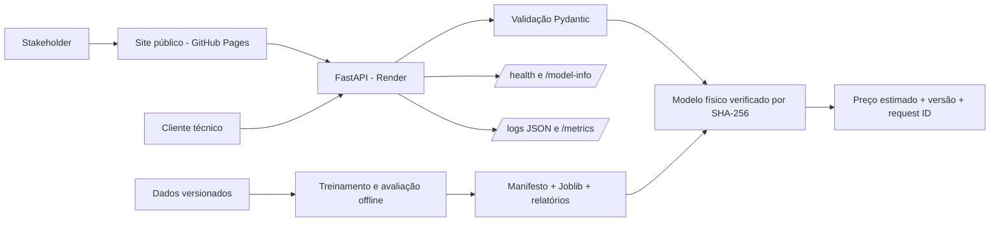

# Property Value Insights

Sistema de estimativa de preços residenciais com Machine Learning, com demonstração
web pública, API reproduzível e imagem Docker pronta para execução.

**[Abrir demonstração online](https://iago-aragao.github.io/property-value-insights/) · [Abrir documentação interativa da API](https://property-value-insights-api.onrender.com/docs)**

A entrega atual é a release `v1.0.1`. O projeto foi desenvolvido a partir de um
desafio técnico de previsão de preços de imóveis, mas estruturado como uma solução
que pudesse ser revisada, reproduzida e utilizada por diferentes públicos.

## Visão geral

### O problema

Estimar o valor de um imóvel a partir de suas características físicas e espaciais,
com uma resposta rápida e rastreável para apoiar análises preliminares.

### O que este projeto entrega

- uma demonstração web pública para testar previsões diretamente no navegador;
- uma estimativa de preço em USD para um imóvel informado;
- uma API REST documentada com FastAPI/OpenAPI;
- um modelo versionado e verificado por SHA-256 antes de entrar em serviço;
- uma imagem Docker pública pronta para execução local;
- documentação de resultados, limitações, dados e decisões de modelagem;
- treinamento e avaliação reproduzíveis para revisão técnica.

O sistema é uma ferramenta de apoio quantitativo. Ele não substitui avaliação
imobiliária formal nem deve ser usado como decisão autônoma de crédito.

## Resultados principais

| Evidência | Resultado |
| --- | ---: |
| Vendas elegíveis após o filtro temporal | 21.595 |
| Validação cruzada temporal | 5 janelas expansivas |
| MAE média na validação temporal | US$ 63.880,80 |
| MAE no período diagnóstico | US$ 67.105,71 |
| R² / MAPE no período diagnóstico | 0,8998 / 12,07% |
| MAE no quartil superior | US$ 134.877,87 |
| Acima de US$ 1 milhão | MAE US$ 201.930,60; 69,55% de subestimação |
| Acima de US$ 2 milhões | 46 casos; MAE US$ 544.527,87; 82,61% de subestimação |

O modelo aprovado utiliza somente características físicas e espaciais. Uma
variante com dados demográficos foi avaliada, mas ficou fora do serving porque o
ganho médio foi marginal e os dados introduziam risco de proxies socioeconômicas,
além de origem e vintage não documentados.


O gráfico pertence ao modelo físico servido. O período mais recente foi usado
como diagnóstico e já havia sido consultado; portanto, não representa um teste
final intocado.

## Demonstração online

A forma mais simples de avaliar o projeto é pela demonstração pública:

**<https://iago-aragao.github.io/property-value-insights/>**

Não é necessário instalar Docker, Python, `uv`, clonar o repositório ou baixar
qualquer arquivo. O site permite alterar as características de um imóvel, enviar
os 18 campos exigidos pelo contrato e receber a previsão real produzida pelo
modelo publicado.

O frontend é hospedado no GitHub Pages e se comunica com a API de demonstração
executada no Render. A documentação OpenAPI/Swagger da instância pública está em:

**<https://property-value-insights-api.onrender.com/docs>**

Como a demonstração utiliza uma instância gratuita para serving, a primeira
requisição após um período de inatividade pode levar mais tempo enquanto o
serviço é reativado. Isso não afeta a imagem Docker nem a reprodução local do
projeto.

## Teste local via Docker

Para uma avaliação técnica reproduzível sem instalar o ambiente Python, use a
imagem Docker pública da release. **Não é necessário clonar o repositório para
este caminho.**

### Pré-requisito: Docker

É necessário ter o Docker instalado e em execução:

- Windows e macOS: Docker Desktop;
- Linux: Docker Engine ou Docker Desktop.

A instalação oficial está disponível em <https://docs.docker.com/get-started/get-docker/>.

### 1. Baixe a aplicação

No PowerShell, Bash ou terminal equivalente:

```powershell
docker pull ghcr.io/iago-aragao/property-value-insights:1.0.1
```

`docker pull` baixa a imagem da aplicação para a máquina. Essa imagem já contém o
runtime Python, as dependências, o pacote `property_value_insights`, o modelo
aprovado e seu manifesto.

### 2. Execute a API

```powershell
docker run --rm --name property-value-insights -p 8000:8000 --read-only --tmpfs /tmp --security-opt no-new-privileges:true ghcr.io/iago-aragao/property-value-insights:1.0.1
```

Quando o serviço estiver pronto, abra no navegador:

**<http://127.0.0.1:8000/docs>**

A página apresenta a documentação interativa da API. Nela é possível abrir
`POST /predict`, selecionar **Try it out**, preencher um imóvel e executar uma
previsão sem escrever código adicional.

Para encerrar, pressione `Ctrl+C` no terminal. Como o comando usa `--rm`, o
contêiner é removido automaticamente quando termina.

## Exemplo de previsão

O exemplo abaixo corresponde a um imóvel do conjunto de exemplos futuros
versionado no projeto.

### Entrada

```json
{
  "bedrooms": 4,
  "bathrooms": 1.0,
  "sqft_living": 1680,
  "sqft_lot": 5043,
  "floors": 1.5,
  "waterfront": 0,
  "view": 0,
  "condition": 4,
  "grade": 6,
  "sqft_above": 1680,
  "sqft_basement": 0,
  "yr_built": 1911,
  "yr_renovated": 0,
  "zipcode": "98118",
  "lat": 47.5354,
  "long": -122.273,
  "sqft_living15": 1560,
  "sqft_lot15": 5765
}
```

### Resposta

```json
{
  "predicted_price": 372953.43,
  "currency": "USD",
  "model_version": "0.4.0-rc1",
  "request_id": "b55ae80b6ad24ffb97a06e4963781637"
}
```

Nesse exemplo, o modelo estima um valor de aproximadamente **US$ 373 mil**. O
`request_id` permite rastrear a requisição e `model_version` identifica exatamente
qual versão do modelo produziu a estimativa.

## Como interpretar a previsão

### Onde há melhor evidência

O modelo foi desenvolvido e avaliado sobre os dados históricos disponíveis para
a região e o intervalo temporal representados no conjunto fornecido. Sua melhor
evidência de desempenho está, portanto, em imóveis semelhantes aos observados
nessa distribuição.

### Onde é necessário maior cuidado

- imóveis de alto valor apresentam erro absoluto e tendência de subestimação mais
  elevados;
- imóveis acima de US$ 1 milhão devem receber revisão humana;
- acima de US$ 2 milhões, a evidência disponível é muito mais limitada e a
  avaliação especializada é recomendada;
- ZIPs desconhecidos, coordenadas fora da região, anos futuros e combinações muito
  raras podem estar fora da cobertura prática observada;
- a previsão é uma estimativa estatística, não uma explicação causal do preço.

As evidências completas estão nas reviews
[`C1.3`](docs/reviews/c1-3-model-review.md) e
[`C1.4`](docs/reviews/c1-4-data-quality-review.md), além do
[model card](docs/MODEL_CARD.md).

## Arquitetura



A demonstração pública combina um frontend estático no GitHub Pages com uma
instância da API no Render. A imagem Docker permanece como unidade reproduzível de
serving para execução local e outros ambientes. Registro de modelos, staging,
canary e rollback são apresentados na documentação de arquitetura como evolução
recomendada, não como infraestrutura externa já implantada.

---

# Documentação técnica

As seções abaixo são destinadas a desenvolvedores, revisores e avaliadores que
desejam reproduzir o ambiente, inspecionar os dados ou executar o pipeline.

## Identidade versionada

| Componente | Identidade vigente |
| --- | --- |
| Projeto/pacote | `property-value-insights 1.0.1` |
| Demonstração web | `https://iago-aragao.github.io/property-value-insights/` |
| API pública | `https://property-value-insights-api.onrender.com` |
| Contrato da API | `0.5.0-rc1` |
| Modelo servido | `property_value_hist_gradient_boosting_physical 0.4.0-rc1` |
| Schema do manifesto | `1.0` |
| SHA-256 do artefato | `90ffbab62970c805b7fd65a5488fa727026bdc59b81d56726318374cdce8c439` |

As versões evoluem de forma independente. O valor
`property_value_insights=0.1.0.dev0` preservado no manifesto é metadata histórica
do ambiente que gerou o artefato imutável; ele não substitui a release atual do
projeto.

## Dados

Os arquivos fornecidos estão versionados em `data/raw/`:

- `kc_house_data.csv`: histórico de imóveis com o alvo `price`;
- `zipcode_demographics.csv`: dados demográficos agregados por CEP;
- `future_unseen_examples.csv`: exemplos sem preço para a inferência final.

O contrato, a auditoria inicial e os hashes estão documentados em
[`docs/DATA_CONTRACT.md`](docs/DATA_CONTRACT.md) e no
[`dicionário canônico`](docs/DATA_DICTIONARY.md). A especificação original do
desafio está preservada em [`docs/CHALLENGE_README.md`](docs/CHALLENGE_README.md).

## Instalação pelo código-fonte

Este caminho é destinado à reprodução técnica completa. **Não copie apenas o
`pyproject.toml` ou arquivos isolados. Clone o repositório inteiro e execute os
comandos na raiz do projeto**, onde devem existir pelo menos `pyproject.toml`,
`README.md`, `uv.lock`, `src/`, `tests/` e `artifacts/`.

### Windows

Pré-requisitos: Git e PowerShell. O ambiente de referência usa Python 3.13 e
exatamente `uv 0.12.1`.

Instale o `uv`:

```powershell
powershell -ExecutionPolicy ByPass -c "irm https://astral.sh/uv/0.12.1/install.ps1 | iex"
```

Reabra o PowerShell e execute:

```powershell
git clone https://github.com/iago-aragao/property-value-insights.git
cd property-value-insights
uv --version
uv python install 3.13
uv sync --locked --extra dev
uv run --locked verify-property-release --project-root .
```

O comando `uv --version` deve informar `0.12.1`.

Para iniciar a API diretamente do ambiente instalado:

```powershell
uv run --locked uvicorn property_value_insights.api:app --host 127.0.0.1 --port 8000
```

Abra <http://127.0.0.1:8000/docs>. `Ctrl+C` encerra o serviço.

## Execução completa para desenvolvimento

O arquivo `uv.lock` fixa as dependências diretas e transitivas. Depois de clonar
o repositório e entrar em sua raiz:

```powershell
uv sync --locked --extra dev
uv run --locked ruff check .
uv run --locked pytest -q
uv run --locked verify-property-release --project-root .
uv run --locked python -m ipykernel install --user --name property-value-insights --display-name "Property Value Insights (project)"
uv run --locked jupyter nbconvert --to notebook --execute notebooks/01_eda.ipynb --inplace --ExecutePreprocessor.kernel_name=property-value-insights --ExecutePreprocessor.timeout=600
uv run --locked jupyter nbconvert --to notebook --execute notebooks/02_modeling.ipynb --inplace --ExecutePreprocessor.kernel_name=property-value-insights --ExecutePreprocessor.timeout=600
uv run --locked sanitize-property-notebooks --project-root .
uv run --locked python -m property_value_insights.training --project-root .
uv run --locked python -m property_value_insights.stakeholder_reporting --project-root .
uv run --locked python -m property_value_insights.uncertainty --project-root .
uv run --locked python -m property_value_insights.explainability --project-root .
docker compose up --build
```

O extra `dev` inclui dependências de testes, notebooks e geração de relatórios.
Para instalar somente o projeto e a explicabilidade, use
`uv sync --locked --extra explainability`. O extra `reporting` mantém apenas a
geração dos relatórios de negócio. A imagem de serving não inclui Matplotlib,
SHAP nem os dados brutos e executa somente a API de inferência.

## Imagem Docker da entrega

A release `v1.0.1` está disponível no GitHub Container Registry:

```bash
docker pull ghcr.io/iago-aragao/property-value-insights:1.0.1
docker run --rm -p 8000:8000 --read-only --tmpfs /tmp \
  --security-opt no-new-privileges:true \
  ghcr.io/iago-aragao/property-value-insights:1.0.1
```

A tag `latest` acompanha a release estável. Para reprodução estrita, use o digest
registrado pelo workflow de publicação e pela página do pacote. O serviço expõe
`/health`, `/model-info`, `/predict`, `/predict/batch`, `/metrics` e `/docs`.

## Modelo e artefato

O artefato principal usa características físicas e espaciais com
HistGradientBoostingRegressor e calibração temporal. A alternativa com dados
demográficos permanece documentada como experimento, mas não integra o modelo
empacotado devido ao ganho marginal e ao risco de proxies socioeconômicas.

O treinamento valida a integridade temporal, exclui 18 registros com eventos
posteriores à venda, treina com 21.595 registros, verifica o artefato por hash e
gera as 100 previsões futuras. O contrato completo está em
[`docs/ARTIFACT_CONTRACT.md`](docs/ARTIFACT_CONTRACT.md).

## API de inferência

A API FastAPI carrega e verifica o artefato durante a inicialização. Ela oferece
predição individual e em lote, metadados do modelo, healthcheck, identificadores
de requisição, logs estruturados e métricas Prometheus. O contrato, os exemplos
de requisição e os limites operacionais estão em
[`docs/API_CONTRACT.md`](docs/API_CONTRACT.md).

A instância de demonstração está publicada em
<https://property-value-insights-api.onrender.com/docs>. Ela existe para avaliação
interativa e pode apresentar tempo de inicialização após períodos de inatividade;
a imagem Docker e a execução local continuam sendo a referência para reprodução
técnica.

Após `docker compose up --build`, a documentação OpenAPI local fica disponível em
<http://127.0.0.1:8000/docs>. O contêiner executa como usuário sem privilégios e
é compatível com sistema de arquivos raiz somente leitura.

## Arquitetura e ciclo de vida

A solução distingue o runtime implementado da topologia recomendada para
produção. O [diagrama de arquitetura](diagrams/production_architecture.md) cobre
entrada, serving, observabilidade, CI/CD, registro e rollback. O
[ciclo de vida](diagrams/model_lifecycle.md) mostra a passagem de novos rótulos
por validação, treinamento, gates, staging, aprovação e monitoramento.

A estratégia de reentreinamento está em
[`docs/CONTINUOUS_LEARNING.md`](docs/CONTINUOUS_LEARNING.md). Ela não promove
modelos automaticamente: a automação prepara evidências, e a mudança do champion
exige critérios temporais e aprovação humana.

## Comunicação e governança

O [model card](docs/MODEL_CARD.md) registra uso pretendido, dados, métricas,
importância por permutação, desempenho por faixa, limitações e considerações
éticas. O [resumo para stakeholders](reports/stakeholder_summary.md) traduz as
métricas para decisão de negócio e utiliza um gráfico reproduzido
especificamente para o modelo físico aprovado.

## Análises opcionais

O diagnóstico opcional calibra um intervalo empírico com previsões fora de
amostra das cinco janelas de desenvolvimento e mede cobertura e largura no
período mais recente. Também gera explicações SHAP globais e locais diretamente
do Joblib verificado. Os resultados e as ressalvas estão no
[`relatório de incerteza e explicabilidade`](reports/optional_analysis.md).

Essas rotinas são offline: não modificam o modelo promovido, as 100 previsões,
o contrato da API ou a imagem de serving. O intervalo não é apresentado como
garantia conformal, e as contribuições SHAP não são efeitos causais.

## Ciclo de vida da entrega

As Fases 0–7 registram a construção da primeira versão estável. O Ciclo 1 de
revisão pré-entrega foi concluído com evidências independentes de API, modelo,
dados, documentação e operação. A versão `v1.0.1` consolidou essa revisão e a
lapidação final sem alterar o modelo `0.4.0-rc1`, seu artefato, manifesto, hashes
ou previsões.

As Issues #62, #64, #65 e #70 permanecem como melhorias ou pesquisas futuras e
não representam funcionalidades incluídas nesta entrega. A consolidação completa
está em [`docs/reviews/cycle-1-consolidation.md`](docs/reviews/cycle-1-consolidation.md).

## Estrutura do repositório

```text
data/raw/       arquivos de entrada fornecidos
src/            código reutilizável do projeto
site/           frontend estático da demonstração pública
tests/          testes automatizados
docs/           contratos, releases, processo, arquivo e revisões
artifacts/      artefato e manifesto versionados do modelo
reports/        relatórios e resultados gerados
notebooks/      análises exploratórias reproduzíveis
diagrams/       diagramas de arquitetura e deploy
```

## Processo e documentação adicional

As Fases 0–7 foram desenvolvidas por branches, commits atômicos, revisão
supervisionada e pull requests. O histórico está em
[`PROCESSO_GIT_GITHUB.md`](docs/process/PROCESSO_GIT_GITHUB.md).

A revisão pré-entrega e os ciclos de entrega estão em
[`docs/REVIEW_AND_DELIVERY_PROCESS.md`](docs/REVIEW_AND_DELIVERY_PROCESS.md).

A estratégia de dependências, a verificação em ambiente limpo e as ações de
publicação estão em [`docs/RELEASE_READINESS.md`](docs/RELEASE_READINESS.md).

## Licença e dados

O código-fonte e a documentação original estão disponíveis sob a
[licença MIT](LICENSE). Os arquivos brutos recebidos para o desafio não são
relicenciados; as condições e os limites aplicáveis estão descritos no
[`DATA_NOTICE.md`](DATA_NOTICE.md).

As mudanças publicadas estão registradas no [`CHANGELOG.md`](CHANGELOG.md).
